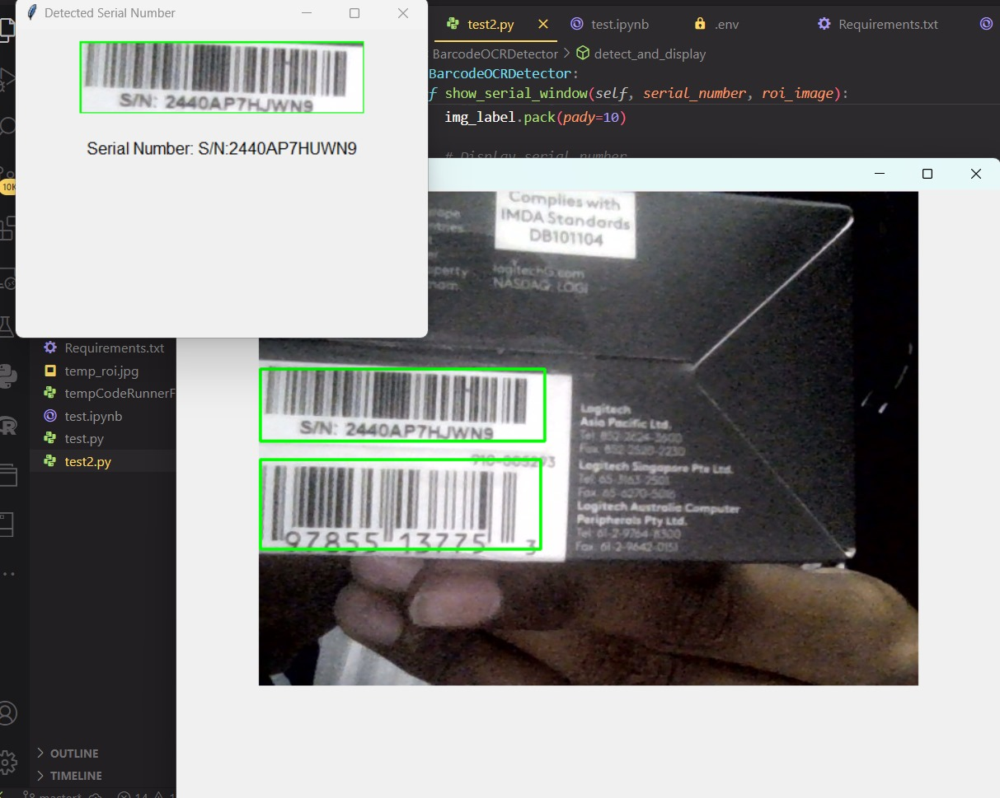

# Recycling Deposit Scanner

## Overview
The **Recycling Deposit Scanner** application leverages YOLO for object detection and Tesseract OCR for serial number recognition to facilitate efficient recycling deposit management. Users can scan recyclable items, determine their material type, calculate deposit values, and generate a receipt.

## Features
1. **YOLO-Powered Detection**: Uses YOLO for object detection to identify regions of interest in the live video feed.
2. **Tesseract OCR Integration**: Recognizes serial numbers from the detected regions.
3. **Material Classification**: Categorizes recyclable materials (e.g., PET, HDPE, ALU, GLASS) based on serial numbers.
4. **Dynamic Receipt Generation**: Provides a detailed summary of scanned items, including material types, counts, and total deposit values.
5. **Session Management**: Maintains state across sessions for scanned items and images.
6. **Image Saving**: Captures and stores images of scanned items for reference.

## Requirements
### Software:
- Python 3.8+
- Streamlit
- OpenCV
- Ultralyitics YOLO
- Tesseract-OCR

### Python Libraries:
Install the required libraries using pip:
```bash
pip install opencv-python streamlit ultralytics pytesseract
```

### Tesseract-OCR:
Ensure Tesseract-OCR is installed. Use one of the following paths for configuration:
- Windows: `C:\Program Files\Tesseract-OCR\tesseract.exe`
- Linux: `/usr/bin/tesseract` or `/usr/local/bin/tesseract`

## Usage
1. **Start the Application**:
   Run the application in the terminal:
   ```bash
   streamlit run app.py
   ```

2. **Select Camera**:
   Choose the desired camera from the dropdown menu.

3. **Start Scanning**:
   - Click the "Start Scanning" button to begin detecting recyclable items.
   - The application captures serial numbers and classifies materials dynamically.

## Example Output

Below is an example of the detected serial number and material classification:




4. **Stop Scanning**:
   Click the "Stop Scanning" button to halt the scanning process.

5. **Generate Receipt**:
   - Click "End Session & Print Receipt" to view a summary of scanned items.
   - Optionally start a new session to reset the scanned items.

## Material Categories
| Material Type | Code | Deposit Value (Euro Cents) |
|---------------|------|---------------------------|
| PET           | 1    | 25                        |
| HDPE          | 2    | 20                        |
| ALU           | 3    | 30                        |
| GLASS         | 4    | 15                        |

## File Outputs
1. **Scanned Item Images**:
   Images of scanned items are saved for reference and displayed in the receipt.
2. **Receipt Details**:
   A dynamically generated receipt provides:
   - Scanning date and time
   - Material types, counts, and values
   - Total items and deposit value

## Code Highlights
1. **Material Detection**:
   - Material type and value are determined using the serial number's first character.
   ```python
   def determine_material(self, text):
       material_code = str(ord(text[0]) % 4 + 1)
       material_type = next(
           (mat for mat, info in self.MATERIAL_CATEGORIES.items()
            if info['code'] == material_code),
           'Unknown'
       )
       pfand_value = self.MATERIAL_CATEGORIES.get(material_type, {'value': 0})['value']
       return material_type, pfand_value
   ```

2. **OCR Processing**:
   - Serial numbers are extracted from bounding boxes detected by YOLO.
   ```python
   def get_ocr_reading(self, frame, bbox):
       roi = frame[y1:y2, x1:x2]
       gray_roi = cv2.cvtColor(roi, cv2.COLOR_BGR2GRAY)
       _, binary = cv2.threshold(gray_roi, 0, 255, cv2.THRESH_BINARY + cv2.THRESH_OTSU)
       custom_config = r'--oem 3 --psm 6 -c tessedit_char_whitelist=ABCDEFGHIJKLMNOPQRSTUVWXYZ0123456789'
       text = pytesseract.image_to_string(binary, config=custom_config).strip()
       return text
   ```

3. **Receipt Generation**:
   - A detailed receipt is dynamically generated using Streamlit components.

## Future Enhancements
- Support for additional recyclable materials.
- Export receipts as PDF.
- Integration with a database for logging historical data.
- Mobile compatibility via Streamlit Mobile or Flutter integration.

## Contributors
Developed by **Sehastrajit S. & Gokul Raj S**

